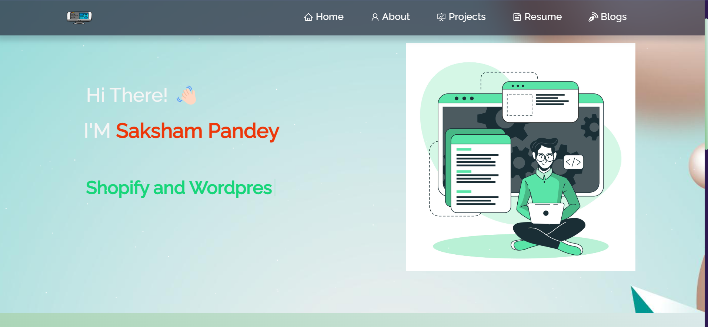

# myportfolio.github.io

                                             My Portfolio Website
   Welcome to my portfolio website! This is a React-based website that showcases my projects, skills, and experience as a developer. The website is designed to be responsive and user-friendly, with a modern and clean look.
   
 ->The project is hosted on the link https://myportfolio-github-io-seven.vercel.app/
     

        ->Getting Started

To run the website on your local machine, you'll need to have Node.js installed. Once you have Node.js installed, follow these steps:

1.Clone this repository to your local machine.

2.Navigate to the project directory using the terminal or command prompt.

3.Run npm install to install the project dependencies.

4.Run npm start to start the development server.

5.Open your browser and navigate to http://localhost:3000 to view the website.

        ->Features

Home page with an introduction.

Projects page with a list of my completed projects, each with a brief description and a link to the live demo and source code.

About Page with  skills, and experience sections.
Blog section

         ->Technologies Used

React,
React Router,
Bootstrap,
CSS.
